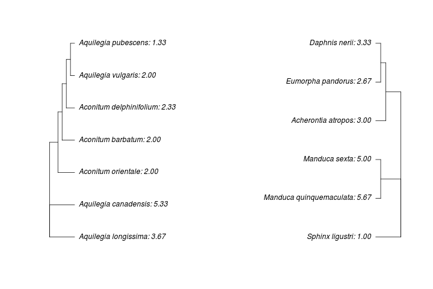

# Coevolution_phylo_bioinformatics2018
The program provided in this repository visualizes coevolution of traits of two coevolving species. It produces two aligned phylogenetic trees facing each other and providing the mean trait value per species.

**To run this program you have to download this repository, run the MasterScript.sh and provide an input file (_see below_) that is located in the same directory.**
## Composition
This program is separated in two segments: The first part is a python1 script that askes for a csv file as input which contains species names, a group ID (which tree it should be part of), the trait examined and the individual trait values. It uses the species names to download genomic data from GenBank2. So far, group one is using ribosomal DNA whereas group two uses mitochondrial DNA. This is due to our example data set that contains plants (group one) and their insect pollinators (group two). After downloading the sequences in fasta-format, they are being combined per group and converted into a format to be alligned. Thereafter, the sequences are used to create a newick tree file.
The second segment of the program is a R3 script that usees the newick tree file to plot the trees as final output.
## Installation
This program uses all following packages for each programming language that need to be installed beforehand: 
* bash4:
  * phyml5
  * clustalW6
  * newick utilities7
* python:
  * biopython8
* R:
  * ape9
  * phangorn10
  * seqinr11
## Usage
After installing all requirements, the only one left is a correct input file.
Here is an example table containing all the required columns (can be more individual columns):

The output will be an image of two face-to-face phylogenetic trees of both groups of species, including the mean trait values per 
species, like this:

## References

1 - Python Software Foundation. Python Language Reference, version 2.7. Available at http://www.python.org

2 - National Center for Biotechnology Information (NCBI)[Internet]. Bethesda (MD): National Library of Medicine (US), National Center for Biotechnology Information; [1988] – [cited 2017 Apr 06]. Available from: https://www.ncbi.nlm.nih.gov/
(The date within the square brackets represents your date of citing the site.)

3 - R version 3.2.3 (2015-12-10) -- "Wooden Christmas-Tree"
Copyright (C) 2015 The R Foundation for Statistical Computing
Platform: x86_64-pc-linux-gnu (64-bit)

4 - GNU bash, version 4.3.48(1)-release (x86_64-pc-linux-gnu)
Copyright (C) 2013 Free Software Foundation, Inc.
License GPLv3+: GNU GPL version 3 or later <http://gnu.org/licenses/gpl.html>

5 - "New Algorithms and Methods to Estimate Maximum-Likelihood Phylogenies: Assessing the Performance of PhyML 3.0."
Guindon S., Dufayard J.F., Lefort V., Anisimova M., Hordijk W., Gascuel O.
Systematic Biology, 59(3):307-21, 2010.

6 - ClustalW and ClustalX version 2 (2007)
Larkin MA, Blackshields G, Brown NP, Chenna R, McGettigan PA, McWilliam H, Valentin F, Wallace IM, Wilm A, Lopez R, Thompson JD, Gibson TJ and Higgins DG Bioinformatics 2007 23(21): 2947-2948. doi:10.1093/bioinformatics/btm404 
7 - The Newick Utilities: High-throughput Phylogenetic tree Processing in the UNIX Shell
Thomas Junier and Evgeny M. Zdobnov, Bioinformatics 2010 26:1669-1670

8 - Cock PA, Antao T, Chang JT, Chapman BA, Cox CJ, Dalke A, Friedberg I, Hamelryck T, Kauff F, Wilczynski B and de Hoon MJL (2009) Biopython: freely available Python tools for computational molecular biology and bioinformatics. Bioinformatics, 25, 1422-1423

9 - Paradis E., Claude J. & Strimmer K. 2004. APE: analyses of phylogenetics and evolution in R language. Bioinformatics 20: 289-290.

10 - Schliep K.P. 2011. phangorn: phylogenetic analysis in R. Bioinformatics, 27(4) 592-593

11 - Charif, D. and Lobry, J.R. (2007) 
